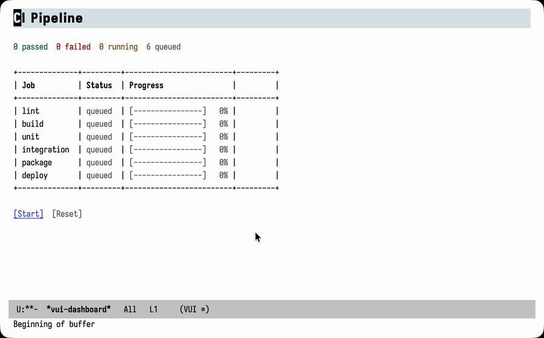

#+TITLE: vui.el
#+AUTHOR: vui.el

#+begin_html

  
  

  

#+end_html

*Declarative, component-based UI framework for Emacs*

Build reactive UIs in Emacs using familiar patterns from React and other modern UI frameworks. Define components with local state, props, lifecycle hooks, and automatic re-rendering.

#+begin_quote
The API is stable and used in [[#built-with-vui][real-world projects]].
#+end_quote

The [[file:docs/examples/11-dashboard.el][CI Pipeline dashboard]] example — colored status, live progress bars, and reactive updates, all from declarative components:

* Features

- *Components* — Reusable UI building blocks with props and local state
- *Reactive State* — Automatic re-rendering when state changes
- *Hooks* — vui-use-effect, vui-use-ref, vui-use-memo, vui-use-callback
- *Context* — Share data across component trees without prop drilling
- *Layout Primitives* — hstack, vstack, flex, box, table, list
- *Inline Mounting* — Ephemeral forms inside existing buffers, without taking them over
- *Error Boundaries* — Graceful error handling with fallback UI
- *Developer Tools* — Component inspector, timing profiler, debug logging

* Quick Example

#+begin_src elisp
;;; -*- lexical-binding: t -*-
(require 'vui)

;; Define a component
(vui-defcomponent counter ()
  :state ((count 0))
  :render
  (vui-fragment
   (vui-text (format "Count: %d" count))
   (vui-newline)
   (vui-button "Increment"
               :on-click (lambda ()
                           (vui-set-state :count (1+ count))))))

;; Mount it
(vui-mount (vui-component 'counter) "*counter*")
#+end_src

Result: A buffer with text "Count: 0" and a clickable button. Each click updates the count and re-renders.

* More Examples

** Props and Composition

#+begin_src elisp
(vui-defcomponent greeting (name)
  :render
  (vui-text (format "Hello, %s!" name)))

(vui-defcomponent app ()
  :render
  (vui-vstack
   (vui-component 'greeting :name "Alice")
   (vui-component 'greeting :name "Bob")))
#+end_src

** Form Input

#+begin_src elisp
(vui-defcomponent name-form ()
  :state ((name ""))
  :render
  (vui-fragment
   (vui-text "Enter name: ")
   (vui-field :value name
              :size 20
              :on-change (lambda (v) (vui-set-state :name v)))
   (vui-newline)
   (vui-text (if (string-empty-p name)
                 "Type something..."
               (format "Hello, %s!" name)))))
#+end_src

** Lifecycle Hooks

#+begin_src elisp
(vui-defcomponent timer ()
  :state ((seconds 0))
  :on-mount
  (let ((timer (run-with-timer 1 1
                 (vui-with-async-context
                   (vui-set-state :seconds #'1+)))))
    (lambda () (cancel-timer timer)))

  :render
  (vui-text (format "Elapsed: %d seconds" seconds)))
#+end_src

** Context for Theme

#+begin_src elisp
(vui-defcontext theme 'light)

(vui-defcomponent themed-button (label)
  :render
  (let ((theme (vui-use-context theme-context)))  ; or (use-theme)
    (vui-button label
                :face (if (eq theme 'dark)
                          'custom-button-pressed
                        'custom-button))))

(vui-defcomponent app ()
  :render
  (theme-provider 'dark
    (vui-component 'themed-button :label "Click me")))
#+end_src

* Installation

** MELPA

#+begin_src elisp
(use-package vui
  :ensure t)
#+end_src

** Manual

Clone this repository and add to your load-path:

#+begin_src elisp
(add-to-list 'load-path "/path/to/vui.el")
(require 'vui)
#+end_src

* Documentation

| Document        | Description                      |
|-----------------+----------------------------------|
| [[file:docs/guide/01-getting-started.org][Getting Started]] | Installation and first component |
| [[file:docs/guide/02-components.org][Components]]      | Props, state, composition        |
| [[file:docs/guide/03-primitives.org][Primitives]]      | Text, button, field, etc.        |
| [[file:docs/guide/04-layout.org][Layout]]          | hstack, vstack, table, list      |
| [[file:docs/guide/05-hooks.org][Hooks]]           | vui-use-effect, vui-use-ref, vui-use-memo |
| [[file:docs/guide/06-context.org][Context]]         | Sharing data across components   |
| [[file:docs/guide/07-lifecycle.org][Lifecycle]]       | on-mount, on-update, on-unmount  |
| [[file:docs/guide/08-error-handling.org][Error Handling]]  | Error boundaries                 |
| [[file:docs/guide/09-performance.org][Performance]]     | Optimization techniques          |
| [[file:docs/guide/10-dev-tools.org][Developer Tools]] | Inspector, profiler, debugging   |
| [[file:docs/guide/11-inline.org][Inline Mounting]] | Ephemeral forms in existing buffers |
| [[file:docs/reference/api.org][API Reference]]   | Complete function reference      |

* Deep Dives

In-depth tutorials walking through real-world usage:

- [[https://www.d12frosted.io/posts/2025-12-01-vui-quickstart][Quickstart]] — 15-minute introduction to props, state, and composition
- [[https://www.d12frosted.io/posts/2025-12-02-vui-real-ui][Building a File Browser]] — Practical walkthrough of component decomposition
- [[https://www.d12frosted.io/posts/2025-12-03-vui-context-and-composition][Context and Composition]] — Prop drilling solutions and composition patterns
- [[https://www.d12frosted.io/posts/2025-12-04-vui-hooks-deep-dive][Lifecycle Hooks]] — on-mount, on-unmount, use-effect, use-async and cleanup patterns
- [[https://www.d12frosted.io/posts/2025-12-05-vui-optimisation-hooks][Optimisation Hooks]] — use-ref, use-callback, use-memo and when to use them
- [[https://www.d12frosted.io/posts/2025-12-06-vui-under-the-hood][Under the Hood]] — Virtual nodes, instances, reconciliation, and the render cycle
- [[https://www.d12frosted.io/posts/2025-12-07-vui-patterns-and-pitfalls][Patterns and Pitfalls]] — Practical patterns and common mistakes

For those curious about implementation details:

- [[https://www.d12frosted.io/posts/2025-12-14-implicit-identity-call-order][Implicit Identity]] — How hooks use call order as implicit identity
- [[https://www.d12frosted.io/posts/2025-12-16-cursor-preservation-buffer-rewrite][Cursor Preservation]] — Preserving cursor position across buffer rewrites

Videos:

- [[https://www.youtube.com/watch?v=7H3Lvo9LCvs][Declarative UIs in Emacs with vui.el]] — System Crafters Live! stream exploring vui.el

* Examples

See [[file:docs/examples/][docs/examples/]] for complete, runnable examples:

- [[file:docs/examples/01-hello-world.el][Hello World]] — Basic examples from the getting started guide
- [[file:docs/examples/02-todo-app.el][Todo App]] — Full todo application with add/remove/filter
- [[file:docs/examples/03-forms.el][Forms]] — Form validation, multi-step wizards, settings
- [[file:docs/examples/04-file-browser.el][File Browser]] — Directory navigation with sorting and search
- [[file:docs/examples/05-wine-tasting.el][Wine Tasting]] — Dynamic tables with interactive cells, computed statistics
- [[file:docs/examples/06-collapsible.el][Collapsible]] — Expandable/collapsible sections, FAQ style, nested sections
- [[file:docs/examples/07-semantic-text.el][Semantic Text]] — Headings, emphasis, status messages with customizable faces
- [[file:docs/examples/08-typed-fields.el][Typed Fields]] — Integer/float/symbol input with validation, shopping cart, forms
- [[file:docs/examples/09-inline-form.el][Inline Forms]] — Ephemeral, validated forms expanding at point in existing buffers
- [[file:docs/examples/10-pomodoro.el][Pomodoro Timer]] — Countdown driven by a timer effect, work/break sessions, functional state updates
- [[file:docs/examples/11-dashboard.el][CI Pipeline Dashboard]] — Live table dashboard with colored status, progress gauges, concurrency, and a timer-driven effect

The [[file:docs/examples/11-dashboard.el][CI Pipeline Dashboard]] example in action:

#+caption: CI Pipeline Dashboard example

The [[file:docs/examples/10-pomodoro.el][Pomodoro Timer]] example in action:

#+caption: Pomodoro Timer example
[[file:docs/images/10-pomodoro.png]]

* Available Components

** Primitives

| Component      | Description                    |
|----------------+--------------------------------|
| =vui-text=     | Styled text                    |
| =vui-newline=  | Line break                     |
| =vui-space=    | Horizontal spacing             |
| =vui-button=   | Clickable button with callback |
| =vui-field=    | Text input field               |
| =vui-checkbox= | Toggle checkbox                |
| =vui-select=   | Selection from options         |
| =vui-fragment= | Group elements without wrapper |

** Layout

| Component    | Description                             |
|--------------+-----------------------------------------|
| =vui-hstack= | Horizontal layout with spacing          |
| =vui-vstack= | Vertical layout with spacing/indent     |
| =vui-flex=   | Row distributing width among children   |
| =vui-box=    | Fixed-width container with alignment    |
| =vui-table=  | Table with headers, borders, alignment  |
| =vui-list=   | Dynamic list with key-based reconcile   |

** Higher-Level Components (vui-components.el)

| Component          | Description                                      |
|--------------------+--------------------------------------------------|
| =vui-collapsible=  | Expandable/collapsible section with header       |
| =vui-typed-field=  | Input with type conversion and validation        |
| =vui-integer-field=, =vui-float-field=, etc. | Shortcuts for common types |

#+begin_src elisp
(require 'vui-components)

(vui-collapsible :title "FAQ"
  (vui-text "Hidden by default, click to reveal."))

(vui-collapsible :title "Details" :initially-expanded t
  (vui-text "Visible on load."))

;; Typed field with validation
(vui-integer-field :value 42
                   :min 0 :max 100
                   :show-error 'inline
                   :on-change (lambda (n) (vui-set-state :count n)))
#+end_src

** Semantic Text Components (vui-components.el)

Thin wrappers around =vui-text= with customizable faces:

| Component                       | Inherits From               |
|---------------------------------+-----------------------------|
| =vui-heading= / =vui-heading-N= | =outline-1= ... =outline-8= |
| =vui-strong=                    | =bold=                      |
| =vui-italic=                    | =italic=                    |
| =vui-muted=                     | =shadow=                    |
| =vui-code=                      | =fixed-pitch=               |
| =vui-error=                     | =error=                     |
| =vui-warning=                   | =warning=                   |
| =vui-success=                   | =success=                   |

#+begin_src elisp
(require 'vui-components)

(vui-vstack
 (vui-heading-1 "Main Title")
 (vui-heading-2 "Subsection")
 (vui-strong "Important!")
 (vui-muted "Less important...")
 (vui-code "inline-code")
 (vui-error "Something went wrong"))

;; Or with :level for programmatic use
(vui-heading "Dynamic Heading" :level depth)
#+end_src

Customize faces to fit your theme:

#+begin_src elisp
(set-face-attribute 'vui-heading-1 nil :height 1.3)
(set-face-attribute 'vui-muted nil :slant 'italic)
#+end_src

* Hooks

| Hook               | Description                                |
|--------------------+--------------------------------------------|
| =vui-use-effect=   | Side effects with cleanup                  |
| =vui-use-ref=      | Mutable reference (no re-render on change) |
| =vui-use-callback= | Stable callback reference                  |
| =vui-use-memo=     | Cached computed value                      |
| =vui-use-async=    | Async data loading with cache              |

* Using Shorter Names (Shorthands)

If you prefer the cleaner React-style names without the =vui-= prefix, you have two options:

** Emacs 28+: Read Symbol Shorthands

Add to your file's local variables:

#+begin_src elisp
;; Local Variables:
;; read-symbol-shorthands: (("defc" . "vui-defc") ("use-" . "vui-use-"))
;; End:
#+end_src

This lets you write =defcomponent= instead of =vui-defcomponent= and =use-effect= instead of =vui-use-effect=.

** Aliases

Define aliases in your init file:

#+begin_src elisp
(defalias 'defcomponent 'vui-defcomponent)
(defalias 'defcontext 'vui-defcontext)
(defalias 'use-effect 'vui-use-effect)
(defalias 'use-ref 'vui-use-ref)
(defalias 'use-callback 'vui-use-callback)
(defalias 'use-memo 'vui-use-memo)
(defalias 'use-async 'vui-use-async)
#+end_src

* Developer Tools

#+begin_src elisp
;; Inspect component tree
(vui-inspect)

;; View state of all components
(vui-inspect-state)

;; Profile render performance
(setq vui-timing-enabled t)
;; ... interact with your app ...
(vui-report-timing)

;; Debug render cycles
(setq vui-debug-enabled t)
(vui-debug-show)
#+end_src

* Requirements

- Emacs 29.1 or later
- Lexical binding enabled in your Elisp files (=;;; -*- lexical-binding: t -*-=)
- Built-in =widget.el= (included with Emacs)

** Known Limitations

*** Emacs 29: Single-widget TAB navigation

On Emacs 29.x, pressing =TAB= in a buffer with only *one* tabbable widget (e.g., a single field or button) will error with "No buttons or fields found". This is a [[https://debbugs.gnu.org/cgi/bugreport.cgi?bug=70594][bug in Emacs's widget-move]] fixed in Emacs 30.

Workaround: Add a second widget, or use mouse/direct interaction. Buffers with multiple widgets work fine.

* Major Mode

VUI buffers use =vui-mode=, a major mode derived from =special-mode=. This provides:

- =TAB= / =S-TAB= — Navigate between widgets (buttons, fields)
- =RET= — Activate widget at point
- =q= — Quit window (or self-insert when in a text field)
- =g= — Refresh UI (or self-insert when in a text field)
- Standard =special-mode= bindings (=h= for help, etc.)

** Extending with Custom Keybindings

Users can add bindings to =vui-mode-map=. For example, to enable [[https://github.com/d12frosted/ace-link-vui][ace-link-vui]] for quick widget navigation:

#+begin_src elisp
(define-key vui-mode-map (kbd "o") #'ace-link-vui)
#+end_src

** Deriving Custom Modes

Packages can derive their own modes from =vui-mode= to add custom keybindings:

#+begin_src elisp
(define-derived-mode my-sidebar-mode vui-mode "MySidebar"
  "Custom mode for my sidebar."
  ;; Custom keybindings
  (define-key my-sidebar-mode-map (kbd "q") #'my-sidebar-close)
  (define-key my-sidebar-mode-map (kbd "g") #'my-sidebar-refresh))
#+end_src

When using a derived mode, enable it *before* calling =vui-mount= or =vui-render=. VUI will detect the derived mode and preserve it across re-renders.

* Architecture

vui.el implements a React-like architecture:

1. *Virtual DOM* — Components return vnodes (virtual nodes)
2. *Reconciliation* — Diffing algorithm to minimize DOM updates
3. *Component Instances* — Maintain state and lifecycle across renders
4. *Hooks System* — Composable state and effects
5. *Context Stack* — Provider/consumer pattern for shared state

* Contributing

Contributions welcome! Please:

1. Check existing issues before opening new ones
2. Include tests for new features
3. Follow existing code style
4. Update documentation as needed

* Related Projects

- [[https://github.com/d12frosted/ace-link-vui][ace-link-vui]] — Ace-link style navigation for VUI buffers

** Built with VUI
:PROPERTIES:
:CUSTOM_ID: built-with-vui
:END:

- [[https://github.com/d12frosted/vulpea-ui][d12frosted/vulpea-ui]] — Sidebar UI for vulpea notes
- [[https://github.com/d12frosted/vulpea-journal][d12frosted/vulpea-journal]] — Journaling system with calendar widgets
- [[https://github.com/d12frosted/brb][d12frosted/brb]] — Barberry Garden management system
- [[https://github.com/ahyatt/ekg][ahyatt/ekg]] — The Emacs knowledge graph, app for notes and structured data
- [[https://github.com/ahyatt/emacs-bluesky][ahyatt/emacs-bluesky]] — Bluesky client for Emacs
- [[https://github.com/ChristianTietze/beads.el][ChristianTietze/beads.el]] — Emacs interface to the Beads issue tracking system
- [[https://github.com/r0man/beads.el][r0man/beads.el]] — Emacs mode for the Beads issue tracker (independent client)
- [[https://github.com/r0man/gastown.el][r0man/gastown.el]] — Emacs mode for the Gastown agent orchestrator
- [[https://github.com/zonuexe/unicode-inspector.el][zonuexe/unicode-inspector.el]] — Interactive Unicode character inspector
- [[https://github.com/zonuexe/eijiro-search.el][zonuexe/eijiro-search.el]] — Interactive English-Japanese dictionary viewer

* License

GPL-3.0

* Acknowledgments

Inspired by:
- React (component model, hooks)
- Svelte (reactivity)
- SolidJS (fine-grained updates)
- Emacs widget.el (underlying implementation)

* Support

If you enjoy this project, you can support its development via [[https://github.com/sponsors/d12frosted][GitHub Sponsors]] or [[https://www.patreon.com/d12frosted][Patreon]].
